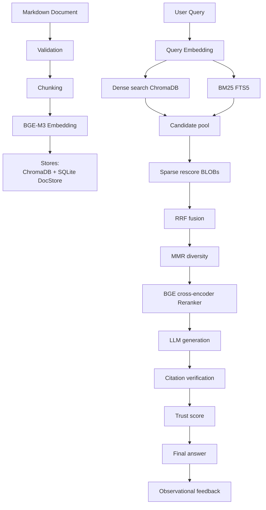

# RAG-Lab Architecture

## 1. Overview

RAG-Lab is a fully local Retrieval-Augmented Generation (RAG) pipeline. It processes Markdown documents and turns each user query into a verified, cited answer without depending on any external service.

The pipeline has **9 sequential phases**:

```
Ingest → Chunking → Embedding → Storage → Retrieval → Reranking → Generation → Verification → Feedback
```

- **Local LLM:** OpenAI-compatible API (default `http://localhost:8000/v1`)
- **Embedding model:** BGE-M3 (BAAI/bge-m3), running locally
- **Active corpus:** SDMX documents (~610 chunks in the official corpus)
- **Typical latency (retrieval + reranker):** P50 ≈ 300 ms

---

## 2. Data flow diagram



---

## 3. Phase 1: Ingestion

**Module:** `rag_lab/ingest/`

### Document validation

Before ingestion, each document is checked against a Markdown contract:

- Valid UTF-8 encoding
- Non-empty document
- YAML frontmatter present and conforming to the contract (required fields: `doc_id`, `domain`, `source_type`, `language`, `version`, `tags`)
- Coherent heading structure
- Well-formed tables

With `--strict` active, a document with invalid frontmatter blocks ingestion.

### Cleaning and manifest

- `clean_document()` removes embedded base64 images to reduce the size of the processed text.
- `create_manifest()` writes `data/ingested.jsonl` with the document hash, preventing re-ingestion of unchanged documents.

### Parallelism and transactions

The ingestion process has two stages:

1. **Parallel stage** (`--workers N` threads): validation + chunking. Does not touch any database.
2. **Sequential stage** (main thread): embedding + write to all three stores.

Each document has its own `IngestTransaction` that groups writes to ChromaDB, SQLite (chunks + FTS5), and the metadata table. If any write fails, a full rollback is executed for that document. Remaining documents continue normally.

---

## 4. Phase 2: Chunking

**Module:** `rag_lab/chunking/`

### Semantic splitting

`chunk_document()` splits the document into `Chunk` objects. Core logic:

- **Never crosses H2 or higher headings.** Each H2 section starts its own group.
- **Tables are kept intact** in a single chunk, never split.
- Maximum chunk size is `CHUNK_MAX_TOKENS = 800` tokens (must be ≤ `EMBEDDING_MAX_LENGTH = 1024`).

### Chunk metadata

| Field | Description |
|---|---|
| `doc_id` | Unique document identifier (from frontmatter) |
| `chunk_id` | Hash of the chunk content |
| `heading_path` | Heading breadcrumb path, e.g. `Introduction > Key concepts` |
| `line_start` / `line_end` | Line range in the original document |
| `tipo` | `texto`, `tabla`, or `formula` |

---

## 5. Phase 3: Embedding

**Module:** `rag_lab/embedding/encoder.py`

### Model

BGE-M3 (BAAI/bge-m3) simultaneously generates **two representations** for each chunk:

- **Dense vector:** 1024 dimensions, cosine similarity.
- **Sparse weights:** weighted vocabulary, compatible with lexical retrieval.

Both representations are computed in a single forward pass at no extra cost.

### Loading and cache

The model is lazily loaded on first use and cached in memory for the rest of the session. Tests call `reset_embedding_cache()` between cases to avoid contamination. The device is read from the `EMBEDDING_DEVICE` environment variable (default `cuda`; tests use `cpu`).

### Batch encoding

Chunks are encoded in batches to maximise GPU throughput. Results are written directly to the stores without intermediate disk I/O.

---

## 6. Phase 4: Storage

**Module:** `rag_lab/storage/`

RAG-Lab uses **two physical stores** that work in coordination:

### ChromaDB — VectorStore

- Path: `storage/chroma_db/`
- Stores only dense vectors (1024-dim).
- HNSW index parameters: M=16, ef_construction=100, ef_search=100.
- Cosine similarity.
- Queried by approximate nearest-neighbour search to generate the dense candidate pool.

### SQLite — DocStore

- Path: `storage/docstore.sqlite`
- **Source of truth** for text, metadata, and sparse vectors.
- Main tables:

| Table | Contents |
|---|---|
| `chunks` | Text, metadata, sparse BLOBs (serialised sparse vectors) |
| `chunks_fts` | FTS5 virtual table for BM25 full-text search |
| `documents` | Per-document metadata (from YAML frontmatter) |
| `tags` / `document_tags` | Tagging system |
| `sources` | Documents registered in the pipeline |
| `cache_revision` | Revision counter for cache invalidation |
| `feedback_events` | Observational user feedback log |
| `ingest_batches` / `ingest_documents` | Ingestion operation traceability |

**Important note:** There is no separate `sparse_index.json` file. Sparse vectors are stored as BLOBs in the `chunks` table of the DocStore SQLite database.

---

## 7. Phase 5: Hybrid retrieval

**Module:** `rag_lab/retrieval/hybrid_search.py`

Retrieval follows a **two-stage architecture** that balances efficiency and quality.

### Stage 1: Candidate pool generation

Two searches run in parallel over the full corpus:

1. **Dense search:** HNSW query in ChromaDB → top-K dense candidates (K = `RETRIEVAL_TOP_K`, default 30; benchmark uses 50).
2. **BM25 / FTS5:** full-text search in the DocStore FTS5 table → top-K lexical candidates.

The union of both sets forms the **candidate pool** (typically 100–300 chunks, deduplicated).

### Stage 2: Sparse rescore

Sparse vectors are loaded from the DocStore BLOBs **only for chunks in the candidate pool** (O(|pool|), not O(N)). This makes sparse scoring viable without a global WAND index.

Three signals are now available per chunk:
- Dense score (ChromaDB)
- BM25 score (FTS5)
- Sparse score (BGE-M3 sparse, rescored over the pool)

### RRF fusion

The three ranked lists are fused using **Reciprocal Rank Fusion** with k=60:

```
score_rrf(chunk) = Σ 1 / (k + rank_i(chunk))
```

### MMR diversity

After RRF, **Maximal Marginal Relevance** (λ=0.6) penalises chunks that are very similar to each other and promotes document-level diversity. Can be disabled with `diversity_mode="off"`.

### FilterSpec

Any search can be constrained to a subset of the corpus via `FilterSpec`:

| Filter | Description |
|---|---|
| `doc_ids` | List of allowed `doc_id` values |
| `tags_include` | Chunk must have all of these tags |
| `tags_exclude` | Chunk must not have any of these tags |
| `domain` | Filter by frontmatter `domain` field |
| `source_type` | Filter by frontmatter `source_type` field |
| `language` | Filter by frontmatter `language` field |
| `version` | Filter by frontmatter `version` field |

---

## 8. Phase 6: Reranking

**Module:** `rag_lab/retrieval/reranker.py`

The reranker applies the BGE-reranker-v2-m3 cross-encoder model over the candidate pool.

### Input format

Each chunk is presented to the cross-encoder with heading context:

```
Document: <doc_id>
Section: <heading_path>

<chunk text>
```

This prefix improves model attention in cross-document queries, though it introduces a minor regression for some Spanish queries against English-prefixed context (see known regression q070 in BENCHMARKS).

### Output

The `RERANK_TOP_K = 8` chunks with the highest cross-encoder scores are passed to the generation phase.

The model is lazily loaded and cached globally (`RERANKER_DEVICE` environment variable, default `cuda`).

---

## 9. Phase 7: Generation

**Module:** `rag_lab/generation/`

- `prompt_builder.py` builds the system prompt with the 8 numbered chunks, mandatory citation instructions, and per-chunk metadata.
- `llm_client.py` calls the local OpenAI-compatible endpoint.

Citations must follow the format:

```
[[N] Fuente: <doc_id> | Sección: <heading_path> | Líneas: <line_start>-<line_end>]
```

This format is required by the system instruction and is what the next phase verifies.

---

## 10. Phase 8: Verification

**Module:** `rag_lab/verification/`

After generating the answer, three checks are executed:

### Citation verification (`verifier.py`)

Analyses the answer with regular expressions to detect citations in the correct format and map each citation to its corresponding chunk.

Generates an `evidence_map`:

```python
{citation_index: {"chunk_id": ..., "doc_id": ..., "lines": ..., "status": "found"|"missing"|"invalid"}}
```

### Consistency check (`consistency.py`)

A second LLM call analyses whether the answer is consistent with the retrieved chunks. Detects potential hallucinations by comparing answer claims against chunk text.

This call can be disabled with `ENABLE_CONSISTENCY_CHECK = False` to save latency.

### Trust score (`scoring.py`)

The confidence score is a weighted sum of four components:

| Component | Weight | What it measures |
|---|---|---|
| Citations | 35% | Fraction of valid, verified citations |
| Retrieval | 30% | Min-max normalised retrieval scores |
| Consistency | 25% | Result of the LLM consistency check |
| Coverage | 10% | Fraction of available chunks referenced |

Retrieval scores are min-max normalised before display.

---

## 11. Phase 9: Feedback

**Module:** `rag_lab/feedback/`

Feedback is a **purely observational log**. It has no effect on the retrieval pipeline or generation.

### FeedbackStore

SQLite (`rag_lab/feedback/feedback.db`). Stores per event:
- Original query
- HyDE flag
- Metadata of displayed chunks
- Score
- Boolean `useful` outcome

### Feedback types

`relevant`, `irrelevant`, `useful`, `not_useful`, `wrong_doc`, `outdated`, `duplicate`, `bad_citation`

### Why it does not affect ranking

Feedback is intentionally frozen as an observational log. Feeding it back into ranking would:
- Amplify early-user biases
- Degrade quality on small corpora with few feedback events
- Make results non-reproducible (the benchmark would cease to be deterministic)

It is available for analysis via `python -m rag_lab.feedback.analyze_feedback`.

---

## 12. Query cache

**Path:** `data/query_cache.sqlite`

### What is cached

The result of `hybrid_search` + `reranker` (the 8 reordered chunks). **LLM responses are not cached.**

### Cache key

The key includes:
- Query text
- Active FilterSpec
- Hash of relevant configuration
- **Corpus fingerprint:** `n_chunks:max_ingest_run_id:revision`

### Invalidation

The corpus fingerprint changes automatically whenever a document is ingested or deleted. This guarantees that a cache built on a previous corpus is never served to a new query.

Default TTL: 7 days. Configurable via `QUERY_CACHE_TTL`.

To disable: `QUERY_CACHE_ENABLED = False`.

---

## 13. Frontmatter and metadata

**YAML contract** (since v1.19)

All ingested documents must include a frontmatter block with the required fields:

```yaml
---
doc_id: unique_identifier
domain: domain_name
source_type: specification|training|glossary|reference|...
language: en|es
version: "x.y"
tags:
  - tag1
  - tag2
---
```

### Metadata storage

Frontmatter fields are stored in the `documents` table of the DocStore. Tags are normalised and stored in the `tags` table with relationships in `document_tags`.

### Derived tags

Beyond explicit frontmatter tags, the pipeline can derive additional tags from `domain`, `source_type`, and `language` to enrich the FilterSpec.

### Use in FilterSpec

All frontmatter fields (`domain`, `source_type`, `language`, `version`) are directly filterable in any search via `FilterSpec`.

---

## 14. Doctor and reconcile

### Health check (`rag-lab doctor`)

Checks the health of the full system:
- Connectivity to the local LLM
- ChromaDB integrity
- DocStore SQLite integrity
- Cross-store consistency (chunk counts)
- FTS5 index status

### Reconcile (`rag-lab reconcile`)

Detects and repairs inconsistencies between stores:

```bash
rag-lab reconcile --check           # diagnosis only, no changes
rag-lab reconcile --repair           # remove ChromaDB orphans
rag-lab reconcile --repair-fts       # fix FTS5 duplicates (v1.16.1+)
rag-lab reconcile --repair-metadata  # back-fill NULL metadata in documents (v1.16.3+)
```

A ChromaDB orphan is a vector whose `chunk_id` does not exist in the DocStore. This can happen if an ingestion fails after writing to ChromaDB but before completing the rollback.

---

## 15. Key design decisions

### HyDE disabled (`HYDE_ENABLED = False`)

HyDE (Hypothetical Document Embeddings) generates a hypothetical text with the LLM before searching. The A/B test over 65 official queries (v1.12) showed:

- R@5: −3.8 pp (FAIL, exceeds the 2 pp regression threshold)
- Latency: ×12.5 (one extra LLM call per query)

BGE-M3 embedding is strong enough for the current SDMX corpus. The hypothetical text shifts the dense search toward slightly different vocabulary, causing more misses than hits. Reconsider if the corpus grows with highly technical vocabulary or if the local LLM model improves significantly.

### Two-stage sparse retrieval (not global)

Applying sparse rescoring to all N corpus chunks would be O(N) — it would require loading all sparse BLOBs from SQLite. The two-stage architecture instead:

1. Generates a candidate pool with dense + BM25 (native index structures).
2. Loads sparse BLOBs **only for the pool** (O(|pool|) ≈ O(100–300)).

This makes sparse scoring viable without implementing a WAND (Weak AND) index, which would require significant additional infrastructure.

### Feedback frozen (no effect on ranking)

Introducing feedback into ranking would create a feedback loop that:
- Amplifies early-user biases
- Degrades quality on small corpora with few feedback events
- Makes results non-reproducible (breaking deterministic benchmarking)

Feedback is kept as a pure observational log, available for manual analysis and for informing configuration decisions in future sprints.

### Query variants disabled

A/B experiments in v1.11 showed zero benefit from query variants (expanding the query with alternative terms) at twice the latency. `QUERY_VARIANT_STOPWORD_ENABLED` and `QUERY_VARIANT_LAST_TERMS_ENABLED` are disabled in production.

---

## Key configuration parameters

All tunable parameters live in `rag_lab/config.py`.

| Parameter | Default | Notes |
|---|---|---|
| `CHUNK_MAX_TOKENS` | 800 | Must be ≤ `EMBEDDING_MAX_LENGTH` (1024) |
| `RETRIEVAL_TOP_K` | 30 | Candidates before reranker; benchmark uses 50 |
| `RERANK_TOP_K` | 8 | Chunks sent to the LLM |
| `RRF_K` | 60 | RRF fusion constant |
| `ENABLE_CONSISTENCY_CHECK` | True | Disabling saves one LLM call per query |
| `HYDE_ENABLED` | False | Disabled: −3.8pp R@5, ×12.5 latency |
| `QUERY_REWRITING_ENABLED` | False | Domain-terminology rewriting |
| `QUERY_CACHE_ENABLED` | True | Retrieval+reranker cache |
| `QUERY_CACHE_TTL` | 7 days | Cache entry TTL |
| `MMR_ENABLED` | True | MMR diversity active in production |
| `EMBEDDING_DEVICE` | `cuda` | From environment variable |
| `RERANKER_DEVICE` | `cuda` | From environment variable |

---

## Directory structure

```
rag_lab/
├── ingest/          # Phase 1: cleaning, validation, manifest
├── chunking/        # Phase 2: semantic splitting into Chunks
├── embedding/       # Phase 3: BGE-M3 encode_chunks()
├── storage/         # Phase 4: ChromaDB + DocStore SQLite
├── retrieval/       # Phases 5-6: hybrid_search, reranker, query_processor
├── generation/      # Phase 7: prompt_builder, llm_client
├── verification/    # Phase 8: verifier, consistency, scoring
├── feedback/        # Phase 9: FeedbackStore, analyze_feedback
├── doc_manager/     # Document catalogue (TUI, tags, deduplication)
├── benchmark/       # Official 65-query suite, runner, compare, report
├── maintenance/     # migrate_to_v2, hnsw_profiles, reconcile
├── config.py        # All tunable parameters
├── cli.py           # Main entry point (ingest/query/chat)
├── cli_chat.py      # Interactive chat loop
├── exceptions.py    # RAGLabError and subclasses
└── logging_config.py  # setup_logging(), rag_lab.log output
storage/
├── chroma_db/       # Persistent ChromaDB
└── docstore.sqlite  # DocStore SQLite
data/
├── ingested.jsonl      # Ingested document manifest
├── query_cache.sqlite  # Retrieval+reranker cache
└── baselines/          # Benchmark baseline JSON files
```
