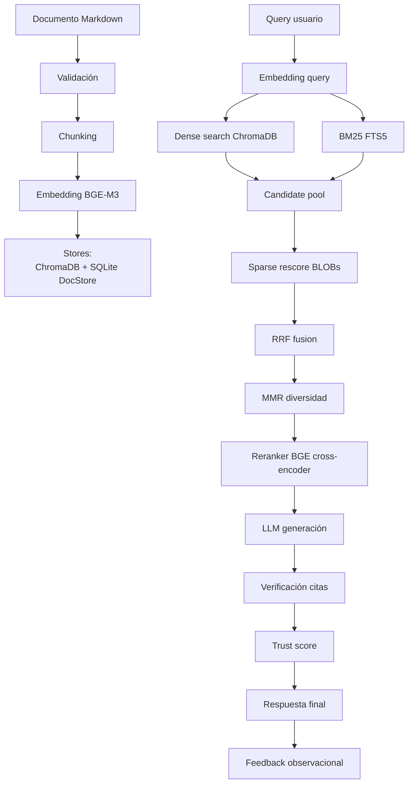

# Arquitectura de RAG-Lab

## 1. Visión general

RAG-Lab es un pipeline de Recuperación Aumentada por Generación (RAG) completamente local. Procesa documentos Markdown y transforma cada consulta del usuario en una respuesta verificada con citas, sin depender de servicios externos.

El pipeline tiene **9 fases secuenciales**:

```
Ingestión → Chunking → Embedding → Almacenamiento → Retrieval → Reranking → Generación → Verificación → Feedback
```

- **LLM local:** compatible con la API OpenAI (por defecto `http://localhost:8000/v1`)
- **Modelo de embedding:** BGE-M3 (BAAI/bge-m3), producción local
- **Corpus activo:** documentos SDMX (~610 chunks en el corpus oficial)
- **Latencia típica (retrieval + reranker):** P50 ≈ 300 ms

---

## 2. Diagrama de flujo



---

## 3. Fase 1: Ingesta

**Módulo:** `rag_lab/ingest/`

### Validación del documento

Antes de ingestar, cada documento pasa por un contrato de validación Markdown:

- Codificación UTF-8 válida
- Documento no vacío
- Frontmatter YAML presente y conforme al contrato (campos obligatorios: `doc_id`, `domain`, `source_type`, `language`, `version`, `tags`)
- Estructura de cabeceras coherente
- Tablas bien formadas

Si `--strict` está activo, un documento con frontmatter inválido bloquea la ingesta.

### Limpieza y manifest

- `clean_document()` elimina imágenes base64 embebidas para reducir el tamaño del texto procesado.
- `create_manifest()` escribe `data/ingested.jsonl` con el hash del documento, evitando reingesta de documentos sin cambios.

### Paralelismo y transacciones

El proceso de ingesta tiene dos etapas:

1. **Etapa paralela** (`--workers N` hilos): validación + chunking. No toca ninguna base de datos.
2. **Etapa secuencial** (hilo principal): embedding + escritura en los tres stores.

Cada documento tiene su propia `IngestTransaction` que agrupa las escrituras en ChromaDB, SQLite (chunks + FTS5) y la tabla de metadatos. Si cualquier escritura falla, se ejecuta rollback completo para ese documento. Los documentos restantes continúan.

---

## 4. Fase 2: Chunking

**Módulo:** `rag_lab/chunking/`

### División semántica

`chunk_document()` divide el documento en objetos `Chunk`. La lógica central:

- **Nunca cruza cabeceras H2 o superiores.** Cada sección H2 inicia un grupo propio.
- **Las tablas se mantienen íntegras** en un único chunk, nunca partidas.
- El tamaño máximo por chunk es `CHUNK_MAX_TOKENS = 800` tokens (debe ser ≤ `EMBEDDING_MAX_LENGTH = 1024`).

### Metadatos de cada chunk

| Campo | Descripción |
|---|---|
| `doc_id` | Identificador único del documento (del frontmatter) |
| `chunk_id` | Hash del contenido del chunk |
| `heading_path` | Ruta de cabeceras, p. ej. `Introducción > Conceptos clave` |
| `line_start` / `line_end` | Rango de líneas en el documento original |
| `tipo` | `texto`, `tabla` o `formula` |

---

## 5. Fase 3: Embedding

**Módulo:** `rag_lab/embedding/encoder.py`

### Modelo

BGE-M3 (BAAI/bge-m3) genera simultáneamente **dos representaciones** para cada chunk:

- **Vector denso:** 1024 dimensiones, similitud coseno.
- **Pesos dispersos (sparse):** vocabulario ponderado, compatibles con recuperación léxica.

Ambas representaciones se calculan en un único pase forward, sin coste adicional.

### Carga y caché

El modelo se carga de forma diferida (lazy) la primera vez que se necesita y queda en caché en memoria para el resto de la sesión. En tests, se llama a `reset_embedding_cache()` entre casos para evitar contaminación. El dispositivo se lee de la variable de entorno `EMBEDDING_DEVICE` (por defecto `cuda`; tests usan `cpu`).

### Batch encoding

Los chunks se codifican en lotes para maximizar el rendimiento en GPU. El resultado se almacena directamente en los stores sin pasar por disco.

---

## 6. Fase 4: Almacenamiento

**Módulo:** `rag_lab/storage/`

RAG-Lab usa **dos stores físicos** que trabajan de forma coordinada:

### ChromaDB — VectorStore

- Ruta: `storage/chroma_db/`
- Almacena exclusivamente los vectores densos (1024-dim).
- Índice HNSW con parámetros: M=16, ef_construction=100, ef_search=100.
- Similitud coseno.
- Se consulta por similitud aproximada para generar el candidate pool denso.

### SQLite — DocStore

- Ruta: `storage/docstore.sqlite`
- Es la **fuente de verdad** para texto, metadatos y vectores dispersos.
- Tablas principales:

| Tabla | Contenido |
|---|---|
| `chunks` | Texto, metadatos, sparse BLOBs (vectores dispersos serializados) |
| `chunks_fts` | Tabla virtual FTS5 para búsqueda BM25 |
| `documents` | Metadatos por documento (del frontmatter YAML) |
| `tags` / `document_tags` | Sistema de etiquetado |
| `sources` | Documentos registrados en el pipeline |
| `cache_revision` | Contador de revisión para invalidación de caché |
| `feedback_events` | Log observacional de feedback de usuario |
| `ingest_batches` / `ingest_documents` | Trazabilidad de operaciones de ingesta |

**Nota importante:** No existe un fichero `sparse_index.json` separado. Los vectores dispersos se almacenan como BLOBs en la tabla `chunks` del DocStore SQLite.

---

## 7. Fase 5: Retrieval híbrido

**Módulo:** `rag_lab/retrieval/hybrid_search.py`

El retrieval sigue una arquitectura **de dos etapas** para combinar eficiencia y calidad.

### Etapa 1: Generación del candidate pool

Se ejecutan dos búsquedas en paralelo sobre el corpus completo:

1. **Dense search:** consulta HNSW en ChromaDB → top-K candidatos densos (K = `RETRIEVAL_TOP_K`, por defecto 30; el benchmark usa 50).
2. **BM25 / FTS5:** búsqueda de texto completo en la tabla FTS5 del DocStore → top-K candidatos léxicos.

La unión de ambos conjuntos forma el **candidate pool** (típicamente 100–300 chunks, sin duplicados).

### Etapa 2: Sparse rescore

Los vectores dispersos se cargan desde los BLOBs del DocStore **sólo para los chunks del candidate pool** (O(|pool|), no O(N)). Esto hace viable el sparse scoring sin un índice WAND global.

Se dispone así de **tres señales** por chunk:
- Puntuación densa (ChromaDB)
- Puntuación BM25 (FTS5)
- Puntuación dispersa (BGE-M3 sparse, recalculada sobre el pool)

### Fusión RRF

Las tres listas se fusionan mediante **Reciprocal Rank Fusion** con k=60:

```
score_rrf(chunk) = Σ 1 / (k + rank_i(chunk))
```

### Diversidad MMR

Después de RRF, se aplica **Maximal Marginal Relevance** (λ=0.6) para penalizar chunks muy similares entre sí y favorecer la diversidad documental. Se puede desactivar con `diversity_mode="off"`.

### FilterSpec

Cualquier búsqueda puede limitarse a un subconjunto del corpus mediante `FilterSpec`:

| Filtro | Descripción |
|---|---|
| `doc_ids` | Lista de `doc_id` permitidos |
| `tags_include` | El chunk debe tener todas estas etiquetas |
| `tags_exclude` | El chunk no debe tener ninguna de estas etiquetas |
| `domain` | Filtro por campo `domain` del frontmatter |
| `source_type` | Filtro por `source_type` del frontmatter |
| `language` | Filtro por `language` del frontmatter |
| `version` | Filtro por `version` del frontmatter |

---

## 8. Fase 6: Reranking

**Módulo:** `rag_lab/retrieval/reranker.py`

El reranker aplica el modelo BGE-reranker-v2-m3 (cross-encoder) sobre los candidatos del candidate pool.

### Formato de entrada

Cada chunk se presenta al cross-encoder con contexto de cabecera:

```
Document: <doc_id>
Section: <heading_path>

<texto del chunk>
```

Este prefijo mejora la atención del modelo en consultas cruzadas, aunque introduce una leve regresión en algunas consultas en español sobre contexto en inglés (ver regresión conocida q070 en BENCHMARKS).

### Salida

Los `RERANK_TOP_K = 8` chunks con mayor puntuación del cross-encoder se pasan a la fase de generación.

El modelo se carga de forma diferida y se cachea globalmente (variable de entorno `RERANKER_DEVICE`, por defecto `cuda`).

---

## 9. Fase 7: Generación

**Módulo:** `rag_lab/generation/`

- `prompt_builder.py` construye el prompt del sistema con los 8 chunks numerados, instrucciones de citación obligatoria y metadatos de cada chunk.
- `llm_client.py` llama al endpoint local compatible con la API OpenAI.

Las citas deben seguir el formato:

```
[[N] Fuente: <doc_id> | Sección: <heading_path> | Líneas: <line_start>-<line_end>]
```

Este formato es exigido por instrucción del sistema y es el que verifica la fase siguiente.

---

## 10. Fase 8: Verificación

**Módulo:** `rag_lab/verification/`

Después de generar la respuesta, se ejecutan tres comprobaciones:

### Verificación de citas (`verifier.py`)

Analiza la respuesta mediante expresiones regulares para detectar citas con el formato correcto y mapear cada cita al chunk correspondiente.

Genera un `evidence_map`:

```python
{citation_index: {"chunk_id": ..., "doc_id": ..., "lines": ..., "status": "found"|"missing"|"invalid"}}
```

### Comprobación de consistencia (`consistency.py`)

Una segunda llamada al LLM analiza si la respuesta es consistente con los chunks recuperados. Detecta posibles alucinaciones comparando afirmaciones de la respuesta contra el texto de los chunks.

Esta llamada se puede desactivar con `ENABLE_CONSISTENCY_CHECK = False` para ahorrar latencia.

### Trust score (`scoring.py`)

El score de confianza se calcula como suma ponderada de cuatro componentes:

| Componente | Peso | Qué mide |
|---|---|---|
| Citas | 35% | Fracción de citas válidas y verificadas |
| Retrieval | 30% | Calidad normalizada (min-max) de las puntuaciones de retrieval |
| Consistencia | 25% | Resultado de la comprobación de consistencia LLM |
| Cobertura | 10% | Fracción de chunks referenciados respecto a los disponibles |

Las puntuaciones de retrieval se normalizan min-max antes de mostrarlas.

---

## 11. Fase 9: Feedback

**Módulo:** `rag_lab/feedback/`

El feedback es un **log observacional puro**. No tiene ningún efecto sobre el pipeline de retrieval ni sobre la generación.

### FeedbackStore

SQLite (`rag_lab/feedback/feedback.db`). Almacena por cada evento:
- Query original
- Flag HyDE
- Metadatos de los chunks mostrados
- Puntuación
- Resultado booleano `useful`

### Tipos de feedback

`relevant`, `irrelevant`, `useful`, `not_useful`, `wrong_doc`, `outdated`, `duplicate`, `bad_citation`

### Por qué no afecta al ranking

El feedback está congelado intencionalmente como log de observación. Introducirlo en el ranking requeriría calibración cuidadosa para evitar sesgo de selección y degradación ante corpus pequeños. Está disponible para análisis mediante `python -m rag_lab.feedback.analyze_feedback`.

---

## 12. Query cache

**Ruta:** `data/query_cache.sqlite`

### Qué se cachea

El resultado de `hybrid_search` + `reranker` (los 8 chunks reordenados). **No se cachean las respuestas del LLM.**

### Clave de caché

La clave incluye:
- Texto de la consulta
- FilterSpec activo
- Hash de la configuración relevante
- **Corpus fingerprint:** `n_chunks:max_ingest_run_id:revision`

### Invalidación

El corpus fingerprint cambia automáticamente cuando se ingesta o elimina cualquier documento. Esto garantiza que una caché construida sobre el corpus anterior no se sirva a una consulta nueva.

TTL por defecto: 7 días. Configurable con `QUERY_CACHE_TTL`.

Para desactivar: `QUERY_CACHE_ENABLED = False`.

---

## 13. Frontmatter y metadatos

**Contrato YAML** (desde v1.19)

Todos los documentos ingestados deben incluir un bloque frontmatter con los campos obligatorios:

```yaml
---
doc_id: identificador_unico
domain: nombre_dominio
source_type: specification|training|glossary|reference|...
language: en|es
version: "x.y"
tags:
  - etiqueta1
  - etiqueta2
---
```

### Almacenamiento de metadatos

Los campos del frontmatter se almacenan en la tabla `documents` del DocStore. Las etiquetas se normalizan y almacenan en la tabla `tags` con relaciones en `document_tags`.

### Etiquetas derivadas

Además de las etiquetas explícitas del frontmatter, el pipeline puede derivar etiquetas adicionales a partir de `domain`, `source_type` y `language` para enriquecer el FilterSpec.

### Uso en FilterSpec

Todos los campos del frontmatter (`domain`, `source_type`, `language`, `version`) son filtrables directamente en cualquier búsqueda mediante `FilterSpec`.

---

## 14. Doctor y reconcile

### Health check (`rag-lab doctor`)

Comprueba la salud del sistema completo:
- Conectividad con el LLM local
- Integridad de ChromaDB
- Integridad del DocStore SQLite
- Coherencia entre stores (recuento de chunks)
- Estado del índice FTS5

### Reconcile (`rag-lab reconcile`)

Detecta y repara inconsistencias entre stores:

```bash
rag-lab reconcile --check          # solo diagnóstico, sin cambios
rag-lab reconcile --repair          # elimina huérfanos de ChromaDB
rag-lab reconcile --repair-fts      # repara duplicados en FTS5 (v1.16.1+)
rag-lab reconcile --repair-metadata # rellena metadatos NULL en documents (v1.16.3+)
```

Un huérfano de ChromaDB es un vector cuyo `chunk_id` no existe en el DocStore. Esto puede ocurrir si una ingesta falla después de escribir en ChromaDB pero antes de completar el rollback.

---

## 15. Decisiones de diseño importantes

### HyDE desactivado (`HYDE_ENABLED = False`)

HyDE (Hypothetical Document Embeddings) genera un texto hipotético con el LLM antes de buscar. El A/B sobre 65 queries oficiales (v1.12) mostró:

- R@5: −3.8 pp (FAIL, supera el umbral de regresión de 2 pp)
- Latencia: ×12.5 (una llamada LLM extra por cada consulta)

El embedding BGE-M3 es suficientemente potente en el corpus SDMX actual. El texto hipotético desplaza la búsqueda densa hacia vocabulario ligeramente diferente, causando más misses que hits. Reconsiderar si el corpus crece con documentación de vocabulario muy técnico o si el modelo LLM local mejora significativamente.

### Sparse en dos etapas (no global)

Aplicar el rescore disperso a todos los N chunks del corpus sería O(N) en número de chunks, ya que requeriría cargar todos los BLOBs de sparse desde SQLite. En cambio, la arquitectura de dos etapas:

1. Genera un candidate pool con dense + BM25 (estructuras de índice nativas).
2. Carga los BLOBs dispersos **sólo del pool** (O(|pool|) ≈ O(100–300)).

Esto hace el sparse scoring viable sin implementar un índice WAND (Weak AND), que requeriría infraestructura adicional compleja.

### Feedback sin efecto en ranking (frozen)

Introducir el feedback en el ranking crearía un bucle de retroalimentación que:
- Amplificaría sesgos de los primeros usuarios
- Degradaría la calidad en corpus pequeños con pocos eventos de feedback
- Haría los resultados no reproducibles (el benchmark dejaría de ser determinista)

El feedback se mantiene como log observacional puro, disponible para análisis manual y para informar decisiones de configuración en sprints futuros.

### Variantes de consulta desactivadas

Los experimentos A/B de v1.11 mostraron cero beneficio de las variantes de consulta (expansión de la query con términos alternativos) con el doble de latencia. Las opciones `QUERY_VARIANT_STOPWORD_ENABLED` y `QUERY_VARIANT_LAST_TERMS_ENABLED` están desactivadas en producción.

---

## Parámetros de configuración clave

Todos los parámetros configurables se encuentran en `rag_lab/config.py`.

| Parámetro | Valor por defecto | Notas |
|---|---|---|
| `CHUNK_MAX_TOKENS` | 800 | Debe ser ≤ `EMBEDDING_MAX_LENGTH` (1024) |
| `RETRIEVAL_TOP_K` | 30 | Candidatos antes del reranker; benchmark usa 50 |
| `RERANK_TOP_K` | 8 | Chunks enviados al LLM |
| `RRF_K` | 60 | Constante de fusión RRF |
| `ENABLE_CONSISTENCY_CHECK` | True | Desactivar ahorra una llamada LLM por consulta |
| `HYDE_ENABLED` | False | Desactivado: −3.8pp R@5, ×12.5 latencia |
| `QUERY_REWRITING_ENABLED` | False | Reescritura con terminología de dominio |
| `QUERY_CACHE_ENABLED` | True | Caché de retrieval+reranker |
| `QUERY_CACHE_TTL` | 7 días | TTL de entradas de caché |
| `MMR_ENABLED` | True | Diversidad MMR activa en producción |
| `EMBEDDING_DEVICE` | `cuda` | Desde variable de entorno |
| `RERANKER_DEVICE` | `cuda` | Desde variable de entorno |

---

## Estructura de directorios

```
rag_lab/
├── ingest/          # Fase 1: limpieza, validación, manifest
├── chunking/        # Fase 2: división semántica en Chunks
├── embedding/       # Fase 3: BGE-M3 encode_chunks()
├── storage/         # Fase 4: ChromaDB + DocStore SQLite
├── retrieval/       # Fase 5-6: hybrid_search, reranker, query_processor
├── generation/      # Fase 7: prompt_builder, llm_client
├── verification/    # Fase 8: verifier, consistency, scoring
├── feedback/        # Fase 9: FeedbackStore, analyze_feedback
├── doc_manager/     # Catálogo de documentos (TUI, tags, duplicados)
├── benchmark/       # Suite oficial 65 queries, runner, compare, report
├── maintenance/     # migrate_to_v2, hnsw_profiles, reconcile
├── config.py        # Todos los parámetros configurables
├── cli.py           # Punto de entrada principal (ingest/query/chat)
├── cli_chat.py      # Loop de chat interactivo
├── exceptions.py    # RAGLabError y subclases
└── logging_config.py  # setup_logging(), fichero rag_lab.log
storage/
├── chroma_db/       # ChromaDB persistente
└── docstore.sqlite  # DocStore SQLite
data/
├── ingested.jsonl   # Manifest de documentos ingestados
├── query_cache.sqlite  # Caché de retrieval+reranker
└── baselines/       # Archivos JSON de baseline de benchmark
```
